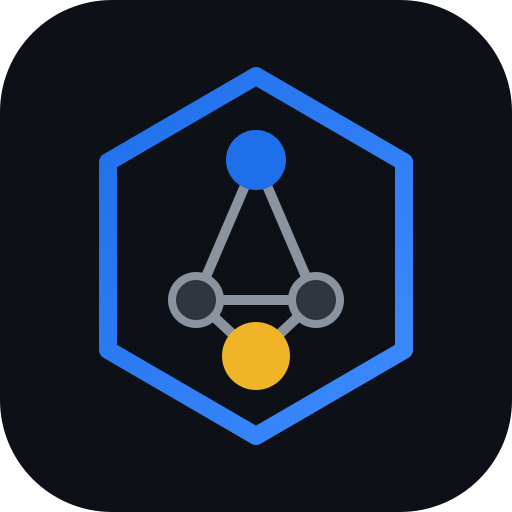

# SEASI Oficina — «La Oficina»

 



**Shell de escritorio local-first para el kernel [SEASI-CORE](../SEASI-CORE)** — «La Oficina»: donde el equipo (humanos y agentes) ficha, trabaja y colabora en tiempo real. Electron + TypeScript estricto + React. Cliente cero: PGK.

> ⚠️ **Estado honesto**: v0 técnico interno. Probado a nivel kernel y dominios (240 tests), con smoke de ventana y sesión real de validación. **No apto para distribución externa** hasta cruzar `npm run gate:commercial` (ver [docs/DEPLOYMENT.md](docs/DEPLOYMENT.md)). Nada de revender todavía.

> Change de origen: `SEASI-CORE/openspec/changes/sea-sic-core-v0/`. Despliegue: [docs/DEPLOYMENT.md](docs/DEPLOYMENT.md).

## Arquitectura en una línea

```
UI React ──(window.seasi.call / window.seasi.shell)──▶ main Electron ──(JSON-RPC stdio)──▶ uv run python -m seasi_core.rpc
```

- **Un solo canal IPC de kernel** (`seasi:rpc`) + canales locales namespaced `shell:*` — superficie auditada por `scripts/audit-ipc.mjs` (CI).
- **El canal de negocio es JSON-RPC estructurado**; el "log visual" de sesión es la cola del ledger (`seasi.event.tail`), nunca parseo de terminal (v0: la vista de log de terminal en vivo llega con el adaptador streaming; hoy los eventos del ledger SON el log).
- Contratos **generados** desde `SEASI-CORE/schemas/v1` con los mismos sha256 que verifica el CI del kernel: si algo deriva, falla en ambas repos. División documentada: **zod valida forma; pydantic + scope_guard validan semántica** (invariants cross-field no exportables a draft-07).

## Dominios (screaming architecture)

| Dominio | Qué | Tests |
|---|---|---|
| `kernel-bridge/` | cliente tipado RPC, errores kernel→tipos | unit + integración REAL contra kernel vía `uv` |
| `oficina/` | event store humano local: fichaje, diario, tareas (JSONL append-only + hash-chain) | cadena/tamper + reglas fail-closed + proyecciones |
| `brain/` | parser `[[wikilinks]]`, grafo, board kanban, mover tarjetas | corpus adversarial + perf 5k links |
| `update/` | feed firmado ed25519, anti-downgrade, verificación de artefacto | claves reales, forjas, canal equivocado |
| `backup/` | backups con ancla de hashes + restauración verificada | corrupción byte, manifest ilegible, truncamiento |
| `vault/` | safeStorage + env-injection; valores NUNCA cruzan IPC | no-fuga por serialización, nombres fail-closed |
| `branding/` | tenant.json en 3 planos (marca/capacidades/gobierno) | fail-closed, gramática tenant_id |

## Desarrollo

```bash
ELECTRON_SKIP_BINARY_DOWNLOAD=1 npm install   # deps sin binario (tests/typecheck)
npm run contracts && npm run contracts:check  # SSOT gate
npm run typecheck && npm test                 # 54 tests (incluye kernel real vía uv)
node scripts/audit-ipc.mjs                    # superficie IPC auditada
SEASI_CORE_DIR=../SEASI-CORE npm run dev      # con binario real de electron
```

Requisitos: Node 22+, `uv` con SEASI-CORE al lado (`~/SEASI-CORE`).

## Reglas del repo

1. `src/contracts/gen/` es **generado** — no se edita a mano.
2. Seguridad por defecto: sandbox, contextIsolation, nodeIntegration off, CSP, window-open deny, `shell:*` validan TODO input de renderer (regex estrictos en brain/backup ids).
3. Sin telemetría. Diagnóstico = paquete local exportado por el usuario.
4. Estado "interno": sin firma; ver fase comercial en DEPLOYMENT.md antes de instalar fuera de PGK.

## Estado v0.1.0

- [x] Kernel channel + 7 métodos RPC (hitl.create/list/decide, usage.summary, streaming por notificaciones)
- [x] Rail de oficina + **streaming en vivo** (notificaciones `seasi.session.event` broadcast a la UI)
- [x] Cola HITL: crear/listar/aprobar/rechazar con intents sellados
- [x] Brain: grafo SVG + board + edición de notas
- [x] Vault (safeStorage + env overlay al kernel + credenciales MCP_*)
- [x] Backups con ancla + verificación; diagnóstico local; update check firmado
- [x] White-label: tenant.json aplicado a UI (nombre/colores)
- [x] Proxy local MCP OAuth (loopback, refresh con skew, fail-closed)
- [x] Dashboard de uso (turnos + tokens por sesión) + estado del proxy
- [x] Gate comercial scriptable (`npm run gate:commercial`) + entitlements con rechazo cross-tenant
